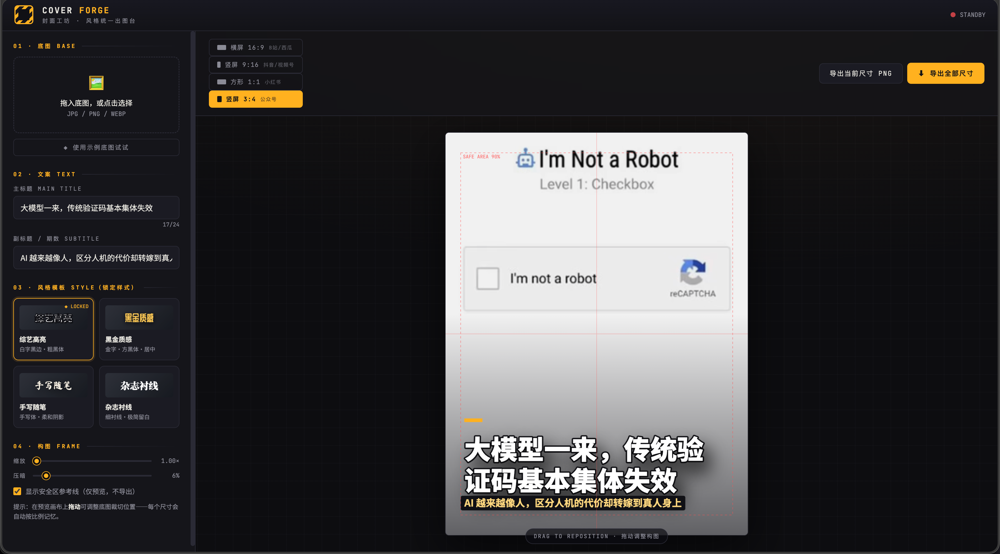

# cover-forge

**封面工坊**——一个单文件网页工具，双击就能用。

| 版本 | 效果 |
| ---- | ---- |
| 1.0.0 |  |

**核心思路（保证风格统一的关键）：**

- **4 套锁定样式模板**：综艺高亮（白字黑边）、黑金质感、手写随笔、杂志衬线。字体、字号比例、描边、阴影、装饰线全部写死在模板里，你只能选模板、不能改细节——所以不管换多少标题，出来的封面永远长一个样。
- **文字是 Canvas 绘制**，不是 AI 生成，绝不出错字，像素级一致。
- **自动本地缓存**：文案、模板、尺寸、缩放、压暗、每个尺寸的构图位置和底图都自动保存在浏览器里，刷新或误关页面不丢，接着上次继续做。

**使用流程：**

1. 拖入底图（或先点“使用示例底图”玩一下）
2. 输入主标题 + 副标题 + 角标（如主标题「凌晨四点的菜市场」、副标题「城市夜行记」、角标 `VOL.07`——角标显示在右上角，样式随模板锁定）
3. 选一套风格模板，之后所有封面都用它
4. 顶部切换 16:9 / 4:3 / 9:16 / 1:1 / 3:4 预览，画布上可直接拖动调整裁切位置
5. 「导出全部尺寸」一键下载五个平台的 PNG（横屏 1280×720、横屏 4:3 1440×1080、竖屏 1080×1920 等）

以后每期视频就是：换底图 → 改标题 → 导出，一分钟出全套封面。